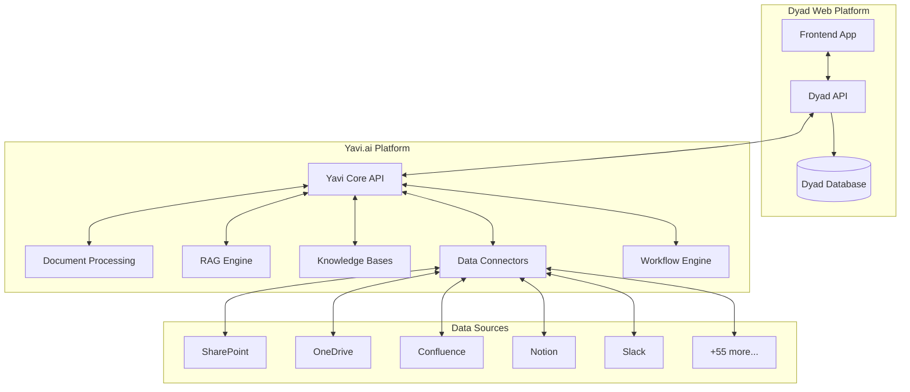

# Yavi.ai Integration Guide

**Comprehensive guide for integrating Yavi.ai's document processing platform with the Dyad Web Platform**

---

## Overview

This guide details how Yavi.ai's powerful document processing and AI capabilities integrate with the Dyad Web Platform to create a unified AI-powered application development experience. The integration enables developers to build applications that leverage Yavi.ai's 60+ data connectors, advanced document processing, and RAG (Retrieval-Augmented Generation) capabilities.

### Key Integration Benefits
- **Enhanced Context**: Use documents and knowledge bases to provide AI with relevant context
- **Data Connectors**: Access to 60+ enterprise data sources
- **Document Intelligence**: Advanced document processing and understanding
- **Knowledge Management**: Create and query project-specific knowledge bases
- **Workflow Automation**: Trigger actions based on document events and processing

---

## Architecture Overview



---

## API Integration

### Authentication

All Yavi.ai API calls use API key authentication with optional OAuth for user-specific operations.

```typescript
// Yavi.ai API Client Configuration
const yaviClient = new YaviClient({
  apiKey: process.env.YAVI_API_KEY,
  baseURL: process.env.YAVI_API_URL || 'https://api.yavi.ai',
  timeout: 30000
})

// Optional: OAuth for user-specific operations
const yaviUserClient = new YaviClient({
  apiKey: process.env.YAVI_API_KEY,
  userToken: userSession.yaviToken, // From OAuth flow
  baseURL: process.env.YAVI_API_URL
})
```

### Core Integration Points

#### 1. Document Processing Integration

```typescript
// Process documents uploaded to Dyad projects
export class DocumentProcessor {
  async processProjectDocument(
    projectId: string,
    documentUrl: string,
    options: ProcessingOptions = {}
  ): Promise<ProcessedDocument> {
    try {
      // Upload document to Yavi.ai for processing
      const processingJob = await yaviClient.documents.process({
        url: documentUrl,
        projectId,
        options: {
          extractText: true,
          generateSummary: true,
          extractEntities: true,
          classifyDocument: true,
          generateEmbeddings: true,
          ...options
        }
      })

      // Store reference in Dyad database
      await this.storeDocumentReference(projectId, processingJob)

      // Return processing job details
      return processingJob
    } catch (error) {
      logger.error('Document processing failed:', error)
      throw new Error('Failed to process document')
    }
  }

  async getProcessedDocument(documentId: string): Promise<ProcessedDocument> {
    const doc = await yaviClient.documents.get(documentId)
    return {
      id: doc.id,
      title: doc.title,
      content: doc.extractedText,
      summary: doc.summary,
      entities: doc.entities,
      classification: doc.classification,
      metadata: doc.metadata,
      embedding: doc.embedding
    }
  }
}
```

#### 2. Knowledge Base Integration

```typescript
// Create and manage project-specific knowledge bases
export class KnowledgeBaseManager {
  async createProjectKnowledgeBase(
    projectId: string,
    config: KnowledgeBaseConfig
  ): Promise<KnowledgeBase> {
    const kb = await yaviClient.knowledgeBases.create({
      name: `${config.name} (Project: ${projectId})`,
      description: config.description,
      projectId,
      settings: {
        autoUpdate: true,
        embeddingModel: 'text-embedding-ada-002',
        chunkSize: 1000,
        chunkOverlap: 200
      }
    })

    // Store KB reference in Dyad database
    await this.storeKnowledgeBase(projectId, kb)

    return kb
  }

  async addDocumentsToKB(
    kbId: string,
    documentIds: string[]
  ): Promise<void> {
    await yaviClient.knowledgeBases.addDocuments(kbId, {
      documentIds,
      reprocess: true
    })
  }

  async queryKnowledgeBase(
    kbId: string,
    query: string,
    options: QueryOptions = {}
  ): Promise<KBQueryResult> {
    return await yaviClient.knowledgeBases.query(kbId, {
      query,
      limit: options.limit || 5,
      threshold: options.threshold || 0.7,
      includeContext: true,
      includeMetadata: true
    })
  }
}
```

#### 3. Data Connector Integration

```typescript
// Manage data connectors for projects
export class ConnectorManager {
  async getAvailableConnectors(): Promise<Connector[]> {
    return await yaviClient.connectors.list({
      status: 'active',
      includeCapabilities: true
    })
  }

  async setupConnector(
    projectId: string,
    connectorType: string,
    config: ConnectorConfig
  ): Promise<ConnectorInstance> {
    const connector = await yaviClient.connectors.setup({
      type: connectorType,
      projectId,
      config: {
        ...config,
        webhookUrl: `${process.env.DYAD_API_URL}/webhooks/yavi/${projectId}`
      }
    })

    // Store connector instance reference
    await this.storeConnectorInstance(projectId, connector)

    return connector
  }

  async syncConnector(connectorId: string): Promise<SyncResult> {
    return await yaviClient.connectors.sync(connectorId, {
      fullSync: false,
      notifyOnComplete: true
    })
  }
}
```

---

## Frontend Integration

### React Components for Yavi.ai Features

#### Document Upload and Processing

```tsx
import React, { useState, useCallback } from 'react'
import { useDropzone } from 'react-dropzone'
import { ProcessedDocument } from '@/types/yavi'
import { yaviService } from '@/services/yavi'

interface DocumentProcessorProps {
  projectId: string
  onDocumentProcessed: (doc: ProcessedDocument) => void
}

export function DocumentProcessor({ projectId, onDocumentProcessed }: DocumentProcessorProps) {
  const [processing, setProcessing] = useState(false)
  const [progress, setProgress] = useState(0)

  const onDrop = useCallback(async (acceptedFiles: File[]) => {
    setProcessing(true)

    for (const file of acceptedFiles) {
      try {
        // Upload file to Dyad storage
        const uploadUrl = await uploadFile(file, projectId)

        // Process document with Yavi.ai
        const processingJob = await yaviService.processDocument(uploadUrl, {
          projectId,
          extractText: true,
          generateSummary: true,
          extractEntities: true
        })

        // Poll for completion
        const processedDoc = await pollProcessingComplete(processingJob.id, setProgress)

        onDocumentProcessed(processedDoc)
      } catch (error) {
        console.error('Document processing failed:', error)
      }
    }

    setProcessing(false)
    setProgress(0)
  }, [projectId, onDocumentProcessed])

  const { getRootProps, getInputProps, isDragActive } = useDropzone({
    onDrop,
    accept: {
      'application/pdf': ['.pdf'],
      'application/msword': ['.doc'],
      'application/vnd.openxmlformats-officedocument.wordprocessingml.document': ['.docx'],
      'text/plain': ['.txt']
    },
    maxSize: 50 * 1024 * 1024 // 50MB
  })

  return (
    <div className="document-processor">
      <div
        {...getRootProps()}
        className={`dropzone ${isDragActive ? 'active' : ''} ${processing ? 'processing' : ''}`}
      >
        <input {...getInputProps()} />

        {processing ? (
          <div className="processing-indicator">
            <div className="progress-bar">
              <div className="progress-fill" style={{ width: `${progress}%` }} />
            </div>
            <p>Processing document... {progress}%</p>
          </div>
        ) : (
          <div className="drop-message">
            <FileText className="icon" size={48} />
            <p>
              {isDragActive
                ? 'Drop documents here to process with Yavi.ai'
                : 'Drag & drop documents or click to upload'}
            </p>
            <p className="supported-formats">
              Supports PDF, Word, and text documents up to 50MB
            </p>
          </div>
        )}
      </div>
    </div>
  )
}
```

#### Knowledge Base Query Interface

```tsx
import React, { useState, useEffect } from 'react'
import { Search, BookOpen, ExternalLink } from 'lucide-react'
import { KBQueryResult } from '@/types/yavi'
import { yaviService } from '@/services/yavi'

interface KnowledgeBaseQueryProps {
  knowledgeBaseId: string
  className?: string
}

export function KnowledgeBaseQuery({ knowledgeBaseId, className }: KnowledgeBaseQueryProps) {
  const [query, setQuery] = useState('')
  const [results, setResults] = useState<KBQueryResult[]>([])
  const [loading, setLoading] = useState(false)
  const [selectedResult, setSelectedResult] = useState<KBQueryResult | null>(null)

  const handleSearch = async () => {
    if (!query.trim()) return

    setLoading(true)
    try {
      const queryResults = await yaviService.queryKnowledgeBase(knowledgeBaseId, query, {
        limit: 10,
        threshold: 0.6
      })
      setResults(queryResults.results)
    } catch (error) {
      console.error('Knowledge base query failed:', error)
    } finally {
      setLoading(false)
    }
  }

  const insertContext = (result: KBQueryResult) => {
    // Trigger context insertion into AI chat or code editor
    const contextEvent = new CustomEvent('insert-context', {
      detail: {
        content: result.content,
        source: result.source,
        title: result.title
      }
    })
    window.dispatchEvent(contextEvent)
  }

  return (
    <div className={`knowledge-base-query ${className}`}>
      <div className="search-header">
        <div className="search-input-container">
          <Search className="search-icon" size={20} />
          <input
            type="text"
            value={query}
            onChange={(e) => setQuery(e.target.value)}
            onKeyPress={(e) => e.key === 'Enter' && handleSearch()}
            placeholder="Search knowledge base..."
            className="search-input"
          />
          <button
            onClick={handleSearch}
            disabled={loading || !query.trim()}
            className="search-button"
          >
            {loading ? 'Searching...' : 'Search'}
          </button>
        </div>
      </div>

      <div className="search-results">
        {results.map((result, index) => (
          <div
            key={`${result.id}-${index}`}
            className="search-result"
            onClick={() => setSelectedResult(result)}
          >
            <div className="result-header">
              <div className="result-title">
                <BookOpen size={16} />
                <span>{result.title}</span>
              </div>
              <div className="result-score">
                {Math.round(result.score * 100)}% match
              </div>
            </div>

            <div className="result-snippet">
              {result.snippet}
            </div>

            <div className="result-actions">
              <button
                onClick={(e) => {
                  e.stopPropagation()
                  insertContext(result)
                }}
                className="action-button insert-context"
              >
                Use as Context
              </button>

              {result.url && (
                <a
                  href={result.url}
                  target="_blank"
                  rel="noopener noreferrer"
                  className="action-button view-source"
                  onClick={(e) => e.stopPropagation()}
                >
                  <ExternalLink size={14} />
                  View Source
                </a>
              )}
            </div>
          </div>
        ))}

        {results.length === 0 && query && !loading && (
          <div className="no-results">
            <BookOpen size={48} className="no-results-icon" />
            <p>No results found for "{query}"</p>
            <p className="no-results-suggestion">
              Try different keywords or check if documents have been processed.
            </p>
          </div>
        )}
      </div>

      {selectedResult && (
        <div className="result-modal-overlay" onClick={() => setSelectedResult(null)}>
          <div className="result-modal" onClick={(e) => e.stopPropagation()}>
            <div className="modal-header">
              <h3>{selectedResult.title}</h3>
              <button
                onClick={() => setSelectedResult(null)}
                className="close-button"
              >
                ×
              </button>
            </div>

            <div className="modal-content">
              <div className="full-content">
                {selectedResult.content}
              </div>

              {selectedResult.metadata && (
                <div className="metadata">
                  <h4>Document Metadata</h4>
                  <pre>{JSON.stringify(selectedResult.metadata, null, 2)}</pre>
                </div>
              )}
            </div>

            <div className="modal-actions">
              <button
                onClick={() => insertContext(selectedResult)}
                className="primary-button"
              >
                Use as Context
              </button>
            </div>
          </div>
        </div>
      )}
    </div>
  )
}
```

---

## AI Context Enhancement

### Enhanced Code Generation with Document Context

```typescript
// Enhanced AI service that uses Yavi.ai context
export class EnhancedAIService extends AIService {
  async generateCodeWithContext(
    request: CodeGenerationRequest & { projectId: string }
  ): Promise<GenerationResult> {
    // Get relevant documents from Yavi.ai
    const relevantContext = await this.getRelevantContext(
      request.prompt,
      request.projectId
    )

    // Enhance the prompt with document context
    const enhancedPrompt = this.buildEnhancedPrompt(request.prompt, relevantContext)

    // Generate code with enhanced context
    return await super.generateCode({
      ...request,
      prompt: enhancedPrompt,
      context: {
        ...request.context,
        documents: relevantContext.documents,
        knowledgeBase: relevantContext.knowledgeBase
      }
    })
  }

  private async getRelevantContext(
    prompt: string,
    projectId: string
  ): Promise<EnhancedContext> {
    // Search project knowledge bases
    const kbResults = await yaviService.searchProjectDocuments(projectId, prompt, {
      limit: 5,
      threshold: 0.7
    })

    // Get project-specific data from connectors
    const connectorData = await yaviService.getConnectorData(projectId, {
      query: prompt,
      types: ['requirements', 'specifications', 'examples']
    })

    return {
      documents: kbResults.documents,
      connectorData,
      knowledgeBase: kbResults.knowledgeBase
    }
  }

  private buildEnhancedPrompt(
    originalPrompt: string,
    context: EnhancedContext
  ): string {
    let enhancedPrompt = originalPrompt

    if (context.documents.length > 0) {
      enhancedPrompt += '\n\nRelevant Documentation:\n'
      context.documents.forEach(doc => {
        enhancedPrompt += `\n### ${doc.title}\n${doc.content}\n`
      })
    }

    if (context.connectorData.length > 0) {
      enhancedPrompt += '\n\nProject Context:\n'
      context.connectorData.forEach(data => {
        enhancedPrompt += `\n### ${data.source}\n${data.content}\n`
      })
    }

    return enhancedPrompt
  }
}
```

### Smart Context Selection

```typescript
// Intelligent context selection based on prompt analysis
export class ContextSelector {
  async selectRelevantContext(
    prompt: string,
    projectId: string,
    options: ContextSelectionOptions = {}
  ): Promise<SelectedContext> {
    // Analyze prompt to understand intent and requirements
    const promptAnalysis = await this.analyzePrompt(prompt)

    // Search different types of context based on intent
    const contextPromises = []

    if (promptAnalysis.needsDocumentation) {
      contextPromises.push(
        yaviService.searchDocuments(prompt, {
          projectId,
          types: ['documentation', 'specifications'],
          limit: 3
        })
      )
    }

    if (promptAnalysis.needsExamples) {
      contextPromises.push(
        yaviService.searchDocuments(prompt, {
          projectId,
          types: ['examples', 'tutorials'],
          limit: 2
        })
      )
    }

    if (promptAnalysis.needsRequirements) {
      contextPromises.push(
        yaviService.searchDocuments(prompt, {
          projectId,
          types: ['requirements', 'user-stories'],
          limit: 3
        })
      )
    }

    const contextResults = await Promise.all(contextPromises)

    // Rank and filter context by relevance
    const rankedContext = this.rankContextByRelevance(
      contextResults.flat(),
      promptAnalysis
    )

    return {
      documents: rankedContext.slice(0, options.maxDocuments || 5),
      analysis: promptAnalysis,
      totalRelevantDocuments: rankedContext.length
    }
  }

  private async analyzePrompt(prompt: string): Promise<PromptAnalysis> {
    // Use AI to analyze what type of context would be helpful
    const analysis = await this.aiService.analyzePrompt(prompt, {
      categories: [
        'needs_documentation',
        'needs_examples',
        'needs_requirements',
        'needs_api_reference',
        'needs_business_logic'
      ]
    })

    return {
      needsDocumentation: analysis.scores.needs_documentation > 0.7,
      needsExamples: analysis.scores.needs_examples > 0.7,
      needsRequirements: analysis.scores.needs_requirements > 0.7,
      needsApiReference: analysis.scores.needs_api_reference > 0.7,
      needsBusinessLogic: analysis.scores.needs_business_logic > 0.7,
      intent: analysis.intent,
      entities: analysis.entities
    }
  }
}
```

---

## Workflow Integration

### Automated Workflows Based on Document Events

```typescript
// Set up automated workflows triggered by document processing
export class WorkflowManager {
  async setupProjectWorkflows(projectId: string): Promise<void> {
    // Create workflow for new document processing
    await yaviService.createWorkflow({
      name: `Auto-process documents for project ${projectId}`,
      projectId,
      triggers: [
        {
          type: 'document_uploaded',
          projectId
        }
      ],
      actions: [
        {
          type: 'process_document',
          config: {
            extractText: true,
            generateSummary: true,
            extractEntities: true,
            addToKnowledgeBase: true
          }
        },
        {
          type: 'notify_team',
          config: {
            message: 'New document processed and added to knowledge base'
          }
        },
        {
          type: 'update_ai_context',
          config: {
            refreshContextCache: true
          }
        }
      ]
    })

    // Create workflow for requirements changes
    await yaviService.createWorkflow({
      name: `Requirements change detection for project ${projectId}`,
      projectId,
      triggers: [
        {
          type: 'document_updated',
          projectId,
          filters: {
            documentType: 'requirements'
          }
        }
      ],
      actions: [
        {
          type: 'analyze_changes',
          config: {
            compareWith: 'previous_version',
            generateChangeReport: true
          }
        },
        {
          type: 'suggest_code_updates',
          config: {
            scanForImpactedFiles: true,
            generateUpdateSuggestions: true
          }
        },
        {
          type: 'create_task',
          config: {
            title: 'Review requirements changes',
            assignToProjectOwner: true
          }
        }
      ]
    })
  }

  async handleWorkflowEvent(event: WorkflowEvent): Promise<void> {
    switch (event.type) {
      case 'document_processed':
        await this.handleDocumentProcessed(event)
        break

      case 'requirements_changed':
        await this.handleRequirementsChanged(event)
        break

      case 'knowledge_base_updated':
        await this.handleKnowledgeBaseUpdated(event)
        break
    }
  }

  private async handleDocumentProcessed(event: DocumentProcessedEvent): Promise<void> {
    // Refresh AI context cache
    await this.aiContextCache.refresh(event.projectId)

    // Notify project members
    await this.notificationService.notifyProject(event.projectId, {
      type: 'document_processed',
      message: `New document "${event.document.title}" has been processed`,
      actionUrl: `/projects/${event.projectId}/documents/${event.document.id}`
    })

    // Check if document suggests new features or changes
    const suggestions = await yaviService.analyzeDocumentForSuggestions(
      event.document.id,
      event.projectId
    )

    if (suggestions.length > 0) {
      await this.createSuggestedTasks(event.projectId, suggestions)
    }
  }
}
```

---

## Data Connectors Setup

### Common Connector Configurations

#### SharePoint Integration

```typescript
// SharePoint connector setup
export async function setupSharePointConnector(
  projectId: string,
  config: SharePointConfig
): Promise<ConnectorInstance> {
  return await yaviService.setupConnector(projectId, 'sharepoint', {
    siteUrl: config.siteUrl,
    authentication: {
      type: 'oauth2',
      clientId: config.clientId,
      clientSecret: config.clientSecret,
      tenantId: config.tenantId
    },
    scope: {
      libraries: config.documentLibraries || ['Documents'],
      fileTypes: ['pdf', 'docx', 'xlsx', 'pptx', 'txt'],
      maxFileSize: '50MB'
    },
    processing: {
      autoProcess: true,
      extractText: true,
      generateSummary: true,
      addToKnowledgeBase: true
    },
    sync: {
      frequency: 'hourly',
      fullSyncDaily: true
    }
  })
}
```

#### Confluence Integration

```typescript
// Confluence connector setup
export async function setupConfluenceConnector(
  projectId: string,
  config: ConfluenceConfig
): Promise<ConnectorInstance> {
  return await yaviService.setupConnector(projectId, 'confluence', {
    baseUrl: config.baseUrl,
    authentication: {
      type: 'api_token',
      username: config.username,
      apiToken: config.apiToken
    },
    scope: {
      spaces: config.spaces || [],
      includeAttachments: true,
      labels: config.labels || []
    },
    processing: {
      autoProcess: true,
      extractText: true,
      preserveFormatting: true,
      extractLinks: true,
      addToKnowledgeBase: true
    }
  })
}
```

#### Slack Integration

```typescript
// Slack connector for team communications and decisions
export async function setupSlackConnector(
  projectId: string,
  config: SlackConfig
): Promise<ConnectorInstance> {
  return await yaviService.setupConnector(projectId, 'slack', {
    workspaceId: config.workspaceId,
    authentication: {
      type: 'oauth2',
      botToken: config.botToken,
      userToken: config.userToken
    },
    scope: {
      channels: config.channels,
      includePrivateChannels: false,
      messageTypes: ['messages', 'threads'],
      includeBotMessages: false
    },
    processing: {
      extractDecisions: true,
      extractRequirements: true,
      summarizeDiscussions: true,
      linkRelatedMessages: true
    },
    filters: {
      minMessageLength: 50,
      excludeKeywords: ['lunch', 'coffee', 'weekend'],
      includeKeywords: ['requirement', 'feature', 'bug', 'decision']
    }
  })
}
```

---

## Error Handling and Monitoring

### Robust Error Handling

```typescript
// Comprehensive error handling for Yavi.ai integration
export class YaviErrorHandler {
  async handleYaviError(error: any, context: ErrorContext): Promise<void> {
    const errorInfo = {
      timestamp: new Date(),
      service: 'yavi-integration',
      error: {
        message: error.message,
        code: error.code,
        type: error.type
      },
      context
    }

    // Log error details
    logger.error('Yavi.ai integration error:', errorInfo)

    // Handle specific error types
    switch (error.code) {
      case 'RATE_LIMIT_EXCEEDED':
        await this.handleRateLimit(error, context)
        break

      case 'DOCUMENT_PROCESSING_FAILED':
        await this.handleProcessingFailure(error, context)
        break

      case 'KNOWLEDGE_BASE_ERROR':
        await this.handleKnowledgeBaseError(error, context)
        break

      case 'CONNECTOR_ERROR':
        await this.handleConnectorError(error, context)
        break

      default:
        await this.handleGenericError(error, context)
    }

    // Send alert if critical
    if (error.severity === 'critical') {
      await this.sendAlert(errorInfo)
    }
  }

  private async handleRateLimit(error: any, context: ErrorContext): Promise<void> {
    // Implement exponential backoff
    const delay = Math.pow(2, context.retryCount || 0) * 1000

    setTimeout(async () => {
      await this.retryOperation(context, delay)
    }, delay)
  }

  private async handleProcessingFailure(error: any, context: ErrorContext): Promise<void> {
    // Notify user of processing failure
    await this.notificationService.notifyUser(context.userId, {
      type: 'error',
      title: 'Document Processing Failed',
      message: `Failed to process document: ${error.message}`,
      actions: [
        {
          label: 'Retry',
          action: 'retry_document_processing',
          data: { documentId: context.documentId }
        },
        {
          label: 'Contact Support',
          action: 'contact_support',
          data: { errorId: context.errorId }
        }
      ]
    })
  }
}
```

### Health Monitoring

```typescript
// Monitor Yavi.ai integration health
export class YaviHealthMonitor {
  async checkHealth(): Promise<HealthStatus> {
    const checks = await Promise.allSettled([
      this.checkApiConnectivity(),
      this.checkDocumentProcessing(),
      this.checkKnowledgeBaseAccess(),
      this.checkConnectorStatus()
    ])

    return {
      status: this.determineOverallHealth(checks),
      timestamp: new Date(),
      checks: this.formatHealthChecks(checks),
      metrics: await this.getHealthMetrics()
    }
  }

  private async checkApiConnectivity(): Promise<CheckResult> {
    try {
      const startTime = Date.now()
      await yaviService.ping()
      const responseTime = Date.now() - startTime

      return {
        name: 'API Connectivity',
        status: 'healthy',
        responseTime,
        details: 'API is responding normally'
      }
    } catch (error) {
      return {
        name: 'API Connectivity',
        status: 'unhealthy',
        error: error.message,
        details: 'Unable to connect to Yavi.ai API'
      }
    }
  }

  private async checkDocumentProcessing(): Promise<CheckResult> {
    try {
      // Test document processing with a small test document
      const testResult = await yaviService.processTestDocument()

      return {
        name: 'Document Processing',
        status: testResult.success ? 'healthy' : 'degraded',
        processingTime: testResult.processingTime,
        details: testResult.message
      }
    } catch (error) {
      return {
        name: 'Document Processing',
        status: 'unhealthy',
        error: error.message,
        details: 'Document processing service unavailable'
      }
    }
  }
}
```

---

## Best Practices

### Performance Optimization

1. **Caching Strategy**
   ```typescript
   // Cache frequently accessed knowledge base results
   const kbCache = new Map<string, CachedKBResult>()

   async function cachedKBQuery(kbId: string, query: string): Promise<KBQueryResult> {
     const cacheKey = `${kbId}:${hashQuery(query)}`

     if (kbCache.has(cacheKey)) {
       const cached = kbCache.get(cacheKey)!
       if (Date.now() - cached.timestamp < 300000) { // 5 minutes
         return cached.result
       }
     }

     const result = await yaviService.queryKnowledgeBase(kbId, query)
     kbCache.set(cacheKey, { result, timestamp: Date.now() })

     return result
   }
   ```

2. **Batch Operations**
   ```typescript
   // Batch document processing for better efficiency
   async function batchProcessDocuments(documents: Document[]): Promise<ProcessingResult[]> {
     const batches = chunkArray(documents, 10) // Process in batches of 10
     const results = []

     for (const batch of batches) {
       const batchResults = await Promise.all(
         batch.map(doc => yaviService.processDocument(doc.url))
       )
       results.push(...batchResults)

       // Rate limiting delay between batches
       await sleep(1000)
     }

     return results
   }
   ```

### Security Considerations

1. **API Key Management**
   ```typescript
   // Secure API key handling
   class SecureYaviClient {
     private apiKey: string

     constructor() {
       this.apiKey = this.getSecureApiKey()
     }

     private getSecureApiKey(): string {
       // Get from Azure Key Vault or environment
       const keyVaultClient = new KeyVaultClient()
       return keyVaultClient.getSecret('yavi-api-key')
     }

     // Rotate API key periodically
     async rotateApiKey(): Promise<void> {
       const newKey = await this.requestNewApiKey()
       await this.updateKeyVault('yavi-api-key', newKey)
       this.apiKey = newKey
     }
   }
   ```

2. **Data Privacy**
   ```typescript
   // Ensure sensitive data is handled properly
   async function processSensitiveDocument(
     document: Document,
     privacyLevel: 'public' | 'internal' | 'confidential'
   ): Promise<ProcessedDocument> {
     const processingOptions = {
       anonymizePII: privacyLevel !== 'public',
       encryptAtRest: privacyLevel === 'confidential',
       retentionPolicy: privacyLevel === 'confidential' ? '1year' : '5years',
       accessControl: privacyLevel === 'confidential' ? 'restricted' : 'standard'
     }

     return await yaviService.processDocument(document.url, processingOptions)
   }
   ```

---

## Testing Integration

### Integration Tests

```typescript
describe('Yavi.ai Integration', () => {
  beforeEach(async () => {
    // Set up test environment
    yaviService.setTestMode(true)
  })

  describe('Document Processing', () => {
    it('should process uploaded documents', async () => {
      const testDocument = await uploadTestDocument('test.pdf')

      const result = await yaviService.processDocument(testDocument.url, {
        extractText: true,
        generateSummary: true
      })

      expect(result.status).toBe('completed')
      expect(result.extractedText).toBeDefined()
      expect(result.summary).toBeDefined()
    })

    it('should handle processing failures gracefully', async () => {
      yaviService.mockProcessingFailure()

      const testDocument = await uploadTestDocument('corrupt.pdf')

      await expect(
        yaviService.processDocument(testDocument.url)
      ).rejects.toThrow('Document processing failed')
    })
  })

  describe('Knowledge Base Integration', () => {
    it('should create and query knowledge bases', async () => {
      const kb = await yaviService.createKnowledgeBase({
        name: 'Test KB',
        projectId: 'test-project'
      })

      expect(kb.id).toBeDefined()

      const results = await yaviService.queryKnowledgeBase(kb.id, 'test query')
      expect(results).toHaveProperty('documents')
    })
  })
})
```

### Mock Services for Development

```typescript
// Mock Yavi.ai service for development and testing
export class MockYaviService implements YaviService {
  async processDocument(url: string, options?: ProcessingOptions): Promise<ProcessedDocument> {
    // Simulate processing delay
    await sleep(2000)

    return {
      id: 'mock-doc-id',
      title: 'Mock Document',
      extractedText: 'This is mock extracted text from the document.',
      summary: 'Mock summary of the document content.',
      entities: [
        { type: 'PERSON', text: 'John Doe', confidence: 0.95 },
        { type: 'ORG', text: 'Acme Corp', confidence: 0.89 }
      ],
      classification: 'technical_document',
      processingTime: 2000
    }
  }

  async queryKnowledgeBase(kbId: string, query: string): Promise<KBQueryResult> {
    return {
      results: [
        {
          id: 'mock-result-1',
          title: 'Mock Result',
          content: 'This is mock content relevant to your query.',
          score: 0.85,
          source: 'mock-document.pdf'
        }
      ],
      totalResults: 1,
      queryTime: 150
    }
  }
}
```

---

This integration guide provides a comprehensive framework for connecting Yavi.ai's powerful document processing capabilities with the Dyad Web Platform. The integration enhances AI-powered application development by providing rich context, intelligent document processing, and seamless workflow automation.