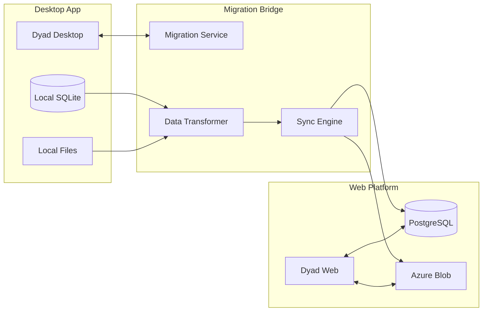

# Dyad Desktop to Web Platform Migration Plan

**Comprehensive strategy for migrating existing Dyad desktop users to the cloud-native web platform while maximizing user retention and value creation**

---

## Executive Summary

This migration plan outlines the strategic approach for transitioning Dyad's 50,000+ desktop users to the new web platform over a 12-month period. The plan prioritizes user experience continuity, data preservation, and feature parity while introducing new cloud-native capabilities that provide compelling reasons to migrate.

### Key Migration Objectives
- **Retain 80%+ of active desktop users** through seamless migration experience
- **Accelerate enterprise adoption** with enhanced collaboration and security features
- **Increase user engagement** with real-time features and AI improvements
- **Generate predictable revenue** through subscription model transition

### Success Metrics
- **User Migration Rate**: 80% of desktop users migrate within 12 months
- **Feature Adoption**: 90% feature parity achieved by month 6
- **User Satisfaction**: 4.5+ stars average rating throughout migration
- **Revenue Growth**: 300% ARR increase from desktop to web conversion

---

## Migration Strategy Overview

### Phase 1: Foundation & Early Adopters (Months 1-3)
**Objective**: Establish platform stability and migrate power users
- Launch web platform beta with core features
- Migrate 10% of users (5,000 early adopters)
- Achieve feature parity for essential workflows
- Establish feedback loops and iteration processes

### Phase 2: Feature Expansion & General Availability (Months 4-6)
**Objective**: Achieve feature parity and open to all users
- Complete remaining feature migrations
- Launch public web platform
- Migrate 40% of users (20,000 total)
- Introduce premium cloud-only features

### Phase 3: Mass Migration & Value Addition (Months 7-9)
**Objective**: Drive mass adoption with enhanced value proposition
- Implement migration incentives and campaigns
- Launch enterprise features and team plans
- Migrate 70% of users (35,000 total)
- Begin desktop deprecation communications

### Phase 4: Completion & Optimization (Months 10-12)
**Objective**: Complete migration and optimize for growth
- Final migration push with desktop sunset timeline
- Achieve 80%+ migration rate (40,000+ users)
- Optimize platform for scale and performance
- Launch advanced AI and collaboration features

---

## Technical Migration Architecture

### Hybrid Bridge System



### Migration Bridge Components

#### 1. Desktop Migration Client
```typescript
// Embedded migration client in desktop app
export class MigrationClient {
  private webPlatformUrl: string = 'https://app.dyad.ai'
  private migrationAPI: MigrationAPI

  constructor(private electronApp: ElectronApp) {
    this.migrationAPI = new MigrationAPI(this.webPlatformUrl)
  }

  async startMigration(userCredentials: UserCredentials): Promise<MigrationSession> {
    // Create migration session
    const session = await this.migrationAPI.createMigrationSession(userCredentials)

    // Collect local data
    const migrationData = await this.collectMigrationData()

    // Start background sync
    const syncProcess = await this.startBackgroundSync(session.id, migrationData)

    return {
      sessionId: session.id,
      status: 'in_progress',
      progress: 0,
      estimatedTimeRemaining: this.calculateEstimatedTime(migrationData),
      syncProcess
    }
  }

  private async collectMigrationData(): Promise<MigrationData> {
    const localDB = await this.electronApp.getDatabase()
    const fileSystem = await this.electronApp.getFileSystem()

    return {
      // User preferences and settings
      settings: await localDB.getUserSettings(),

      // Projects and their metadata
      projects: await localDB.getProjects(),

      // Project files and content
      projectFiles: await this.collectProjectFiles(),

      // Chat history and AI interactions
      chatHistory: await localDB.getChatHistory(),

      // Templates and snippets
      userTemplates: await localDB.getUserTemplates(),

      // Usage analytics (anonymized)
      usageStats: await localDB.getUsageStats()
    }
  }

  private async collectProjectFiles(): Promise<ProjectFile[]> {
    const projects = await this.electronApp.getProjects()
    const files: ProjectFile[] = []

    for (const project of projects) {
      const projectFiles = await this.electronApp.getProjectFiles(project.id)

      for (const file of projectFiles) {
        files.push({
          projectId: project.id,
          path: file.path,
          content: await this.electronApp.readFile(file.fullPath),
          lastModified: file.lastModified,
          size: file.size,
          checksum: await this.calculateChecksum(file.content)
        })
      }
    }

    return files
  }
}
```

#### 2. Cloud Migration Service
```typescript
// Server-side migration processing
export class MigrationService {
  constructor(
    private database: DatabaseService,
    private storage: StorageService,
    private userService: UserService
  ) {}

  async processMigrationData(
    sessionId: string,
    migrationData: MigrationData
  ): Promise<MigrationResult> {
    const session = await this.getMigrationSession(sessionId)

    try {
      // Create user account if doesn't exist
      const user = await this.ensureUserAccount(session.userEmail, migrationData.settings)

      // Migrate user settings and preferences
      await this.migrateUserSettings(user.id, migrationData.settings)

      // Create projects in web platform
      const projectMigrations = await this.migrateProjects(user.id, migrationData.projects)

      // Upload and organize project files
      await this.migrateProjectFiles(projectMigrations, migrationData.projectFiles)

      // Transfer chat history and AI interactions
      await this.migrateChatHistory(user.id, migrationData.chatHistory)

      // Import custom templates
      await this.migrateUserTemplates(user.id, migrationData.userTemplates)

      // Update migration status
      await this.completeMigration(sessionId, {
        status: 'completed',
        migratedProjects: projectMigrations.length,
        migratedFiles: migrationData.projectFiles.length,
        completedAt: new Date()
      })

      return {
        success: true,
        user,
        migratedProjects: projectMigrations.length,
        migratedFiles: migrationData.projectFiles.length,
        webPlatformUrl: `${this.webPlatformUrl}/dashboard`
      }
    } catch (error) {
      await this.handleMigrationError(sessionId, error)
      throw error
    }
  }

  private async migrateProjects(
    userId: string,
    desktopProjects: DesktopProject[]
  ): Promise<ProjectMigration[]> {
    const migrations: ProjectMigration[] = []

    for (const project of desktopProjects) {
      // Create project in web platform
      const webProject = await this.database.createProject({
        name: project.name,
        description: project.description,
        ownerId: userId,
        framework: project.framework,
        template: project.template,
        settings: this.transformProjectSettings(project.settings),
        // Preserve creation date
        createdAt: project.createdAt
      })

      migrations.push({
        desktopProjectId: project.id,
        webProjectId: webProject.id,
        name: project.name,
        status: 'migrated'
      })
    }

    return migrations
  }

  private async migrateProjectFiles(
    projectMigrations: ProjectMigration[],
    projectFiles: ProjectFile[]
  ): Promise<void> {
    // Group files by project
    const filesByProject = new Map<string, ProjectFile[]>()
    for (const file of projectFiles) {
      if (!filesByProject.has(file.projectId)) {
        filesByProject.set(file.projectId, [])
      }
      filesByProject.get(file.projectId)!.push(file)
    }

    // Migrate files for each project
    for (const migration of projectMigrations) {
      const files = filesByProject.get(migration.desktopProjectId) || []

      for (const file of files) {
        // Upload file to cloud storage
        const cloudPath = `projects/${migration.webProjectId}/${file.path}`
        await this.storage.uploadFile(cloudPath, file.content, {
          contentType: this.getContentType(file.path),
          metadata: {
            originalPath: file.path,
            lastModified: file.lastModified.toISOString(),
            checksum: file.checksum
          }
        })

        // Create file record in database
        await this.database.createProjectFile({
          projectId: migration.webProjectId,
          path: file.path,
          content: file.content,
          size: file.size,
          hash: file.checksum,
          createdAt: file.lastModified,
          updatedAt: file.lastModified
        })
      }
    }
  }
}
```

### Real-Time Migration Progress

```typescript
// WebSocket-based progress updates
export class MigrationProgressService {
  private io: SocketIOServer

  constructor(server: HttpServer) {
    this.io = new SocketIOServer(server)
    this.setupMigrationEvents()
  }

  private setupMigrationEvents(): void {
    this.io.on('connection', (socket) => {
      socket.on('start-migration-monitoring', (sessionId: string) => {
        socket.join(`migration:${sessionId}`)
      })

      socket.on('stop-migration-monitoring', (sessionId: string) => {
        socket.leave(`migration:${sessionId}`)
      })
    })
  }

  async updateProgress(
    sessionId: string,
    progress: MigrationProgress
  ): Promise<void> {
    // Update database
    await this.database.updateMigrationProgress(sessionId, progress)

    // Notify connected clients
    this.io.to(`migration:${sessionId}`).emit('migration-progress', {
      sessionId,
      progress: progress.percentage,
      currentStep: progress.currentStep,
      message: progress.message,
      estimatedTimeRemaining: progress.estimatedTimeRemaining,
      errors: progress.errors
    })
  }

  async notifyMigrationComplete(sessionId: string, result: MigrationResult): Promise<void> {
    this.io.to(`migration:${sessionId}`).emit('migration-complete', {
      sessionId,
      success: result.success,
      webPlatformUrl: result.webPlatformUrl,
      summary: {
        projectsMigrated: result.migratedProjects,
        filesMigrated: result.migratedFiles,
        completedAt: result.completedAt
      }
    })
  }
}
```

---

## User Experience Design

### Migration Wizard Flow

#### Desktop App Integration
```typescript
// Migration wizard integrated into desktop app
export class MigrationWizard {
  private steps: MigrationStep[] = [
    {
      id: 'welcome',
      title: 'Welcome to Dyad Web Platform',
      component: WelcomeStep,
      canSkip: false
    },
    {
      id: 'account-setup',
      title: 'Create Your Account',
      component: AccountSetupStep,
      canSkip: false
    },
    {
      id: 'data-selection',
      title: 'Choose What to Migrate',
      component: DataSelectionStep,
      canSkip: false
    },
    {
      id: 'preferences',
      title: 'Transfer Preferences',
      component: PreferencesStep,
      canSkip: true
    },
    {
      id: 'migration-process',
      title: 'Migrating Your Data',
      component: MigrationProgressStep,
      canSkip: false
    },
    {
      id: 'completion',
      title: 'Migration Complete!',
      component: CompletionStep,
      canSkip: false
    }
  ]

  async startWizard(): Promise<void> {
    const wizardWindow = new BrowserWindow({
      width: 800,
      height: 600,
      modal: true,
      resizable: false,
      title: 'Migrate to Dyad Web Platform'
    })

    // Load wizard interface
    await wizardWindow.loadURL(`app://migration-wizard`)

    // Handle wizard completion
    wizardWindow.webContents.on('wizard-complete', (result) => {
      if (result.success) {
        this.showMigrationSuccess(result)
      } else {
        this.showMigrationError(result.error)
      }
    })
  }
}

// React components for migration wizard
export function WelcomeStep({ onNext }: WizardStepProps) {
  return (
    <div className="migration-step welcome">
      <div className="hero-section">
        <div className="hero-icon">
          <Cloud size={64} />
        </div>
        <h1>Welcome to the Future of AI Development</h1>
        <p>
          Dyad Web Platform brings all your favorite features to the cloud,
          plus powerful new capabilities for team collaboration and enterprise use.
        </p>
      </div>

      <div className="benefits-grid">
        <div className="benefit">
          <Users className="benefit-icon" />
          <h3>Team Collaboration</h3>
          <p>Work together in real-time with your team</p>
        </div>
        <div className="benefit">
          <Shield className="benefit-icon" />
          <h3>Enterprise Security</h3>
          <p>SOC2 compliance and advanced security features</p>
        </div>
        <div className="benefit">
          <Zap className="benefit-icon" />
          <h3>Enhanced AI</h3>
          <p>Access to more AI providers and faster generation</p>
        </div>
        <div className="benefit">
          <Database className="benefit-icon" />
          <h3>Cloud Storage</h3>
          <p>Never lose your work with automatic cloud backup</p>
        </div>
      </div>

      <div className="action-section">
        <button onClick={onNext} className="primary-button large">
          Get Started
        </button>
        <p className="migration-note">
          Your desktop app will continue to work during the migration process.
        </p>
      </div>
    </div>
  )
}

export function DataSelectionStep({ onNext, onBack, migrationData }: WizardStepProps) {
  const [selectedItems, setSelectedItems] = useState({
    projects: true,
    settings: true,
    chatHistory: true,
    templates: true,
    usageStats: false
  })

  const [projectSelection, setProjectSelection] = useState<Record<string, boolean>>({})

  useEffect(() => {
    // Initialize all projects as selected
    const initialSelection: Record<string, boolean> = {}
    migrationData.projects.forEach((project: any) => {
      initialSelection[project.id] = true
    })
    setProjectSelection(initialSelection)
  }, [migrationData.projects])

  const getDataSize = (type: string): string => {
    switch (type) {
      case 'projects':
        return formatBytes(migrationData.projects.reduce((sum: number, p: any) => sum + p.size, 0))
      case 'settings':
        return formatBytes(1024) // ~1KB
      case 'chatHistory':
        return formatBytes(migrationData.chatHistory.length * 512) // Estimate
      case 'templates':
        return formatBytes(migrationData.templates.length * 2048) // Estimate
      default:
        return '0 B'
    }
  }

  return (
    <div className="migration-step data-selection">
      <h2>Choose What to Migrate</h2>
      <p>Select the data you'd like to transfer to your new web platform account.</p>

      <div className="data-categories">
        <div className="category">
          <div className="category-header">
            <div className="category-info">
              <Folder className="category-icon" />
              <div>
                <h3>Projects ({migrationData.projects.length})</h3>
                <p>Your Dyad projects and all associated files</p>
              </div>
            </div>
            <div className="category-controls">
              <span className="data-size">{getDataSize('projects')}</span>
              <Switch
                checked={selectedItems.projects}
                onCheckedChange={(checked) =>
                  setSelectedItems(prev => ({ ...prev, projects: checked }))
                }
              />
            </div>
          </div>

          {selectedItems.projects && (
            <div className="project-list">
              {migrationData.projects.map((project: any) => (
                <div key={project.id} className="project-item">
                  <Checkbox
                    checked={projectSelection[project.id]}
                    onCheckedChange={(checked) =>
                      setProjectSelection(prev => ({ ...prev, [project.id]: checked }))
                    }
                  />
                  <div className="project-info">
                    <span className="project-name">{project.name}</span>
                    <span className="project-details">
                      {project.framework} • {project.fileCount} files • {formatBytes(project.size)}
                    </span>
                  </div>
                </div>
              ))}
            </div>
          )}
        </div>

        <div className="category">
          <div className="category-header">
            <div className="category-info">
              <Settings className="category-icon" />
              <div>
                <h3>Settings & Preferences</h3>
                <p>Your customizations and app preferences</p>
              </div>
            </div>
            <div className="category-controls">
              <span className="data-size">{getDataSize('settings')}</span>
              <Switch
                checked={selectedItems.settings}
                onCheckedChange={(checked) =>
                  setSelectedItems(prev => ({ ...prev, settings: checked }))
                }
              />
            </div>
          </div>
        </div>

        <div className="category">
          <div className="category-header">
            <div className="category-info">
              <MessageSquare className="category-icon" />
              <div>
                <h3>Chat History</h3>
                <p>Your AI conversations and generated content</p>
              </div>
            </div>
            <div className="category-controls">
              <span className="data-size">{getDataSize('chatHistory')}</span>
              <Switch
                checked={selectedItems.chatHistory}
                onCheckedChange={(checked) =>
                  setSelectedItems(prev => ({ ...prev, chatHistory: checked }))
                }
              />
            </div>
          </div>
        </div>

        <div className="category">
          <div className="category-header">
            <div className="category-info">
              <Layout className="category-icon" />
              <div>
                <h3>Custom Templates</h3>
                <p>Your personal project templates and snippets</p>
              </div>
            </div>
            <div className="category-controls">
              <span className="data-size">{getDataSize('templates')}</span>
              <Switch
                checked={selectedItems.templates}
                onCheckedChange={(checked) =>
                  setSelectedItems(prev => ({ ...prev, templates: checked }))
                }
              />
            </div>
          </div>
        </div>
      </div>

      <div className="migration-summary">
        <div className="summary-stats">
          <div className="stat">
            <span className="stat-value">
              {Object.values(projectSelection).filter(Boolean).length}
            </span>
            <span className="stat-label">Projects</span>
          </div>
          <div className="stat">
            <span className="stat-value">
              {Object.values(selectedItems).filter(Boolean).length}
            </span>
            <span className="stat-label">Categories</span>
          </div>
          <div className="stat">
            <span className="stat-value">~2-5 min</span>
            <span className="stat-label">Est. Time</span>
          </div>
        </div>
      </div>

      <div className="wizard-actions">
        <button onClick={onBack} className="secondary-button">
          Back
        </button>
        <button
          onClick={() => onNext({ selectedItems, projectSelection })}
          className="primary-button"
          disabled={!Object.values(selectedItems).some(Boolean)}
        >
          Continue Migration
        </button>
      </div>
    </div>
  )
}
```

### Web Platform Onboarding

```typescript
// Welcome experience for migrated users
export function MigratedUserOnboarding({ user, migrationSummary }: OnboardingProps) {
  const [currentStep, setCurrentStep] = useState(0)
  const [completedSteps, setCompletedSteps] = useState<Set<number>>(new Set())

  const onboardingSteps = [
    {
      title: 'Welcome to Dyad Web!',
      component: <WelcomeOverview user={user} summary={migrationSummary} />
    },
    {
      title: 'Explore Your Projects',
      component: <ProjectsOverview projects={user.projects} />
    },
    {
      title: 'New Web Features',
      component: <NewFeaturesHighlight />
    },
    {
      title: 'Team Collaboration',
      component: <CollaborationIntro />
    },
    {
      title: 'AI Enhancements',
      component: <AIFeaturesIntro />
    }
  ]

  return (
    <div className="onboarding-overlay">
      <div className="onboarding-modal">
        <div className="onboarding-header">
          <h2>{onboardingSteps[currentStep].title}</h2>
          <div className="progress-indicator">
            <span>{currentStep + 1} of {onboardingSteps.length}</span>
            <div className="progress-bar">
              <div
                className="progress-fill"
                style={{ width: `${((currentStep + 1) / onboardingSteps.length) * 100}%` }}
              />
            </div>
          </div>
        </div>

        <div className="onboarding-content">
          {onboardingSteps[currentStep].component}
        </div>

        <div className="onboarding-actions">
          {currentStep > 0 && (
            <button
              onClick={() => setCurrentStep(currentStep - 1)}
              className="secondary-button"
            >
              Previous
            </button>
          )}

          {currentStep < onboardingSteps.length - 1 ? (
            <button
              onClick={() => {
                setCompletedSteps(prev => new Set(prev).add(currentStep))
                setCurrentStep(currentStep + 1)
              }}
              className="primary-button"
            >
              Next
            </button>
          ) : (
            <button
              onClick={() => {
                // Mark onboarding as complete
                completeOnboarding()
              }}
              className="primary-button"
            >
              Start Building!
            </button>
          )}

          <button
            onClick={() => skipOnboarding()}
            className="text-button"
          >
            Skip Tour
          </button>
        </div>
      </div>
    </div>
  )
}
```

---

## Data Migration Strategy

### Database Schema Migration

```sql
-- Migration mapping table to track desktop -> web relationships
CREATE TABLE migration_mappings (
    id UUID PRIMARY KEY DEFAULT gen_random_uuid(),
    desktop_user_id VARCHAR(255) NOT NULL,
    web_user_id UUID REFERENCES users(id) ON DELETE CASCADE,
    desktop_project_id VARCHAR(255) NOT NULL,
    web_project_id UUID REFERENCES projects(id) ON DELETE CASCADE,
    migration_session_id UUID NOT NULL,
    migrated_at TIMESTAMP DEFAULT NOW(),
    UNIQUE(desktop_user_id, desktop_project_id)
);

-- Migration sessions table
CREATE TABLE migration_sessions (
    id UUID PRIMARY KEY DEFAULT gen_random_uuid(),
    user_email VARCHAR(255) NOT NULL,
    desktop_version VARCHAR(50),
    status VARCHAR(50) DEFAULT 'pending', -- 'pending', 'in_progress', 'completed', 'failed'
    progress INTEGER DEFAULT 0, -- 0-100
    current_step VARCHAR(100),
    error_message TEXT,
    migration_data JSONB, -- Metadata about what's being migrated
    started_at TIMESTAMP DEFAULT NOW(),
    completed_at TIMESTAMP,
    created_at TIMESTAMP DEFAULT NOW()
);

-- Migration errors and issues tracking
CREATE TABLE migration_issues (
    id UUID PRIMARY KEY DEFAULT gen_random_uuid(),
    session_id UUID REFERENCES migration_sessions(id) ON DELETE CASCADE,
    issue_type VARCHAR(50) NOT NULL, -- 'error', 'warning', 'info'
    component VARCHAR(100), -- 'project', 'file', 'settings', etc.
    item_id VARCHAR(255), -- ID of the item that had an issue
    message TEXT NOT NULL,
    stack_trace TEXT,
    resolved BOOLEAN DEFAULT FALSE,
    created_at TIMESTAMP DEFAULT NOW()
);
```

### File Migration Strategy

```typescript
// Intelligent file migration with conflict resolution
export class FileMigrationService {
  async migrateProjectFiles(
    projectMapping: ProjectMapping,
    desktopFiles: DesktopFile[]
  ): Promise<FileMigrationResult> {
    const results: FileMigrationResult = {
      successful: [],
      failed: [],
      skipped: [],
      conflicts: []
    }

    for (const file of desktopFiles) {
      try {
        // Check if file already exists in web platform
        const existingFile = await this.findExistingFile(
          projectMapping.webProjectId,
          file.path
        )

        if (existingFile) {
          const conflict = await this.handleFileConflict(existingFile, file)
          if (conflict.resolution === 'skip') {
            results.skipped.push({ file: file.path, reason: conflict.reason })
            continue
          } else if (conflict.resolution === 'replace') {
            await this.replaceFile(existingFile, file)
          } else if (conflict.resolution === 'rename') {
            await this.migrateFileWithNewName(projectMapping.webProjectId, file, conflict.newName!)
          }
        } else {
          // Migrate file normally
          await this.migrateFile(projectMapping.webProjectId, file)
        }

        results.successful.push({
          originalPath: file.path,
          newPath: file.path,
          size: file.size
        })

      } catch (error) {
        results.failed.push({
          file: file.path,
          error: error.message,
          recoverable: this.isRecoverableError(error)
        })
      }
    }

    return results
  }

  private async handleFileConflict(
    existingFile: ProjectFile,
    incomingFile: DesktopFile
  ): Promise<ConflictResolution> {
    // Compare file checksums
    const existingChecksum = existingFile.hash
    const incomingChecksum = await this.calculateChecksum(incomingFile.content)

    if (existingChecksum === incomingChecksum) {
      return {
        resolution: 'skip',
        reason: 'Identical content already exists'
      }
    }

    // Compare modification times
    if (existingFile.updatedAt > incomingFile.lastModified) {
      return {
        resolution: 'skip',
        reason: 'Web version is newer'
      }
    }

    if (incomingFile.lastModified > existingFile.updatedAt) {
      return {
        resolution: 'replace',
        reason: 'Desktop version is newer'
      }
    }

    // If timestamps are similar, create both versions
    const timestamp = Date.now()
    const extension = path.extname(incomingFile.path)
    const basename = path.basename(incomingFile.path, extension)
    const dirname = path.dirname(incomingFile.path)

    return {
      resolution: 'rename',
      newName: path.join(dirname, `${basename}_migrated_${timestamp}${extension}`),
      reason: 'Conflicting versions preserved'
    }
  }

  private async migrateFile(
    projectId: string,
    file: DesktopFile
  ): Promise<void> {
    // Upload to cloud storage
    const cloudPath = `projects/${projectId}/${file.path}`
    await this.storageService.uploadFile(cloudPath, file.content, {
      contentType: this.getContentType(file.path),
      metadata: {
        originalPath: file.path,
        migratedFrom: 'desktop',
        lastModified: file.lastModified.toISOString(),
        checksum: file.checksum
      }
    })

    // Create database record
    await this.databaseService.createProjectFile({
      projectId,
      path: file.path,
      content: file.content,
      size: file.size,
      hash: file.checksum,
      mimeType: this.getContentType(file.path),
      createdAt: file.lastModified,
      updatedAt: file.lastModified
    })
  }
}
```

---

## User Communication & Marketing

### Migration Campaign Timeline

#### Pre-Launch (Months 1-2)
**Objective**: Build awareness and anticipation
- **Email Campaign**: "The Future of Dyad is Here"
- **In-App Notifications**: Early access signup for beta
- **Blog Series**: Feature comparisons and benefits
- **Community Engagement**: Discord/Reddit discussions about upcoming features

#### Beta Launch (Month 3)
**Objective**: Validate migration process with early adopters
- **Invitation Campaign**: "You're Invited to Dyad Beta"
- **Migration Webinar**: Live demo of migration process
- **Beta User Forum**: Dedicated space for feedback and support
- **Success Stories**: Case studies from early adopters

#### Public Launch (Months 4-6)
**Objective**: Drive mass awareness and adoption
- **Launch Event**: Virtual launch party with live demos
- **PR Campaign**: Tech media coverage and reviews
- **Social Media Blitz**: Feature highlights and user testimonials
- **Migration Week**: Special focus on helping users migrate

#### Migration Drive (Months 7-9)
**Objective**: Accelerate migration with incentives
- **Migration Incentives**: Discounts, premium features, exclusive content
- **Referral Program**: Rewards for bringing team members
- **Migration Challenge**: Gamified migration experience
- **Customer Success**: Proactive outreach to high-value users

#### Sunset Communication (Months 10-12)
**Objective**: Complete migration and desktop deprecation
- **Sunset Timeline**: Clear communication about desktop end-of-life
- **Final Migration Push**: Last chance campaigns
- **Legacy Support**: Gradual reduction of desktop support
- **Celebration Campaign**: Celebrate migration success stories

### Communication Templates

#### Migration Announcement Email
```html
<!DOCTYPE html>
<html>
<head>
    <title>Exciting News: Dyad Web Platform is Here!</title>
</head>
<body>
    <div class="email-container">
        <div class="header">
            
            <h1>The Future of AI Development is Here</h1>
        </div>

        <div class="hero-section">
            
            <h2>Introducing Dyad Web Platform</h2>
            <p>All your favorite Dyad features, now in the cloud with powerful new capabilities for teams and enterprises.</p>
        </div>

        <div class="benefits-section">
            <h3>What's New:</h3>
            <ul>
                <li>✨ <strong>Real-time Collaboration</strong> - Work with your team simultaneously</li>
                <li>🔒 <strong>Enterprise Security</strong> - SOC2 compliance and advanced security</li>
                <li>🚀 <strong>Enhanced AI</strong> - Access to more AI providers and faster performance</li>
                <li>☁️ <strong>Cloud Sync</strong> - Never lose your work again</li>
                <li>📱 <strong>Access Anywhere</strong> - Work from any device, anywhere</li>
            </ul>
        </div>

        <div class="migration-section">
            <h3>Easy Migration in Just 5 Minutes</h3>
            <p>We've made it incredibly easy to move your projects, settings, and chat history to the web platform. Your desktop app will continue working during the transition.</p>

            <div class="migration-steps">
                <div class="step">
                    <span class="step-number">1</span>
                    <span class="step-text">Click "Migrate to Web" in your desktop app</span>
                </div>
                <div class="step">
                    <span class="step-number">2</span>
                    <span class="step-text">Create your web account (or sign in)</span>
                </div>
                <div class="step">
                    <span class="step-number">3</span>
                    <span class="step-text">Choose what to migrate</span>
                </div>
                <div class="step">
                    <span class="step-number">4</span>
                    <span class="step-text">Relax while we transfer your data</span>
                </div>
                <div class="step">
                    <span class="step-number">5</span>
                    <span class="step-text">Start building in the cloud!</span>
                </div>
            </div>
        </div>

        <div class="cta-section">
            <a href="https://app.dyad.ai/migrate" class="cta-button">
                Start Migration Now
            </a>
            <p class="cta-note">Free for all existing users • No credit card required</p>
        </div>

        <div class="faq-section">
            <h3>Frequently Asked Questions</h3>

            <div class="faq-item">
                <strong>Q: Will my desktop app still work?</strong>
                <p>A: Yes! Your desktop app will continue to work normally during and after the migration. You can use both simultaneously.</p>
            </div>

            <div class="faq-item">
                <strong>Q: Is migration free?</strong>
                <p>A: Absolutely! Migration is free for all existing Dyad users, and you'll get free access to the web platform.</p>
            </div>

            <div class="faq-item">
                <strong>Q: What if I encounter issues?</strong>
                <p>A: Our support team is standing by to help. Contact us at support@dyad.ai or through the help chat in your app.</p>
            </div>
        </div>

        <div class="footer">
            <p>Thank you for being part of the Dyad community!</p>
            <p>The Dyad Team</p>

            <div class="social-links">
                <a href="#">Twitter</a> • <a href="#">Discord</a> • <a href="#">GitHub</a>
            </div>
        </div>
    </div>
</body>
</html>
```

#### In-App Migration Prompt
```typescript
// Progressive migration prompts in desktop app
export class MigrationPromptManager {
  private promptSchedule = [
    { day: 1, type: 'gentle', urgency: 'low' },
    { day: 7, type: 'benefits', urgency: 'low' },
    { day: 14, type: 'social-proof', urgency: 'medium' },
    { day: 30, type: 'incentive', urgency: 'medium' },
    { day: 60, type: 'urgency', urgency: 'high' },
    { day: 90, type: 'final-notice', urgency: 'high' }
  ]

  async showMigrationPrompt(user: User): Promise<void> {
    const daysSinceFirstPrompt = this.getDaysSinceFirstPrompt(user.id)
    const prompt = this.getPromptForDay(daysSinceFirstPrompt)

    if (!prompt) return

    const dialog = new MigrationDialog({
      type: prompt.type,
      urgency: prompt.urgency,
      user,
      onMigrate: () => this.startMigration(user),
      onPostpone: () => this.postponeMigration(user, prompt.type),
      onDismiss: () => this.dismissPrompt(user, prompt.type)
    })

    await dialog.show()
  }

  private getPromptContent(type: string, user: User): PromptContent {
    switch (type) {
      case 'gentle':
        return {
          title: '🎉 Dyad Web Platform is Now Available!',
          message: `Hi ${user.name}! We've launched the web version of Dyad with exciting new features like real-time collaboration and cloud sync. Want to check it out?`,
          primaryAction: 'Explore Web Platform',
          secondaryAction: 'Maybe Later',
          dismissible: true
        }

      case 'benefits':
        return {
          title: '✨ Discover What You\'re Missing',
          message: 'Dyad Web Platform users are already enjoying features like team collaboration, faster AI responses, and automatic cloud backup. Ready to join them?',
          features: [
            'Work with your team in real-time',
            '3x faster AI code generation',
            'Never lose your work with cloud sync',
            'Access your projects from anywhere'
          ],
          primaryAction: 'Start Migration',
          secondaryAction: 'Remind Me Later',
          dismissible: true
        }

      case 'social-proof':
        return {
          title: '🚀 Join 15,000+ Users on the Web Platform',
          message: 'Thousands of developers have already migrated to Dyad Web Platform. Here\'s what they\'re saying:',
          testimonials: [
            {
              quote: 'The collaboration features are a game-changer for our team.',
              author: 'Sarah K., Tech Lead'
            },
            {
              quote: 'Migration was seamless and the performance is noticeably better.',
              author: 'Mike R., Full-stack Developer'
            }
          ],
          primaryAction: 'Migrate Now (5 minutes)',
          secondaryAction: 'Not Yet',
          dismissible: true
        }

      case 'incentive':
        return {
          title: '🎁 Limited Time: Free Premium Features',
          message: 'Migrate to Dyad Web Platform this month and get 3 months of premium features absolutely free! This includes unlimited AI generations, priority support, and advanced collaboration tools.',
          urgencyMessage: 'Offer expires in 15 days',
          primaryAction: 'Claim Free Premium',
          secondaryAction: 'I\'ll Pass',
          dismissible: true
        }

      case 'urgency':
        return {
          title: '⚠️ Important: Desktop App Support Ending Soon',
          message: 'We\'ll be focusing our development efforts on the web platform. Desktop app support will end in 6 months. Migrate now to ensure uninterrupted service.',
          urgencyMessage: 'Desktop support ends June 2024',
          primaryAction: 'Migrate to Web Platform',
          secondaryAction: 'Remind Me Weekly',
          dismissible: false
        }

      case 'final-notice':
        return {
          title: '🚨 Final Notice: Migrate by March 31st',
          message: 'This is your final reminder to migrate to Dyad Web Platform. Desktop app support ends in 30 days. Don\'t risk losing access to your projects.',
          urgencyMessage: 'Only 30 days remaining',
          primaryAction: 'Migrate Now',
          secondaryAction: 'Get Help with Migration',
          dismissible: false
        }
    }
  }
}
```

---

## Success Metrics & Monitoring

### Key Performance Indicators

#### Migration Success Metrics
```typescript
interface MigrationMetrics {
  // User Migration
  totalDesktopUsers: number
  migratedUsers: number
  migrationRate: number // percentage
  monthlyMigrationRate: number

  // Migration Quality
  successfulMigrations: number
  failedMigrations: number
  migrationSuccessRate: number
  averageMigrationTime: number // minutes

  // Data Migration
  projectsMigrated: number
  filesMigrated: number
  dataVolumeMigrated: number // GB
  migrationErrorRate: number

  // User Experience
  userSatisfactionScore: number // 1-5 rating
  supportTicketsPerMigration: number
  migrationAbandonmentRate: number
  postMigrationRetentionRate: number // 30-day retention

  // Business Impact
  conversionToSubscription: number // percentage of migrated users who subscribe
  averageRevenuePerMigratedUser: number
  lifetimeValueIncrease: number // percentage increase from desktop to web
  enterpriseConversionRate: number // percentage converting to enterprise plans
}

// Metrics collection service
export class MigrationMetricsService {
  async trackMigrationEvent(event: MigrationEvent): Promise<void> {
    const metrics = {
      timestamp: new Date(),
      userId: event.userId,
      sessionId: event.sessionId,
      eventType: event.type,
      data: event.data
    }

    // Store in analytics database
    await this.analyticsDB.insertEvent(metrics)

    // Send to real-time dashboard
    await this.updateDashboard(event.type, metrics)

    // Alert on critical events
    if (event.type === 'migration_failed') {
      await this.sendAlert('migration_failure', metrics)
    }
  }

  async generateMigrationReport(timeRange: TimeRange): Promise<MigrationReport> {
    const metrics = await this.calculateMigrationMetrics(timeRange)

    return {
      period: timeRange,
      summary: {
        totalMigrations: metrics.migratedUsers,
        successRate: metrics.migrationSuccessRate,
        averageTime: metrics.averageMigrationTime,
        userSatisfaction: metrics.userSatisfactionScore
      },
      trends: await this.calculateTrends(metrics, timeRange),
      issues: await this.identifyCommonIssues(timeRange),
      recommendations: await this.generateRecommendations(metrics)
    }
  }

  private async identifyCommonIssues(timeRange: TimeRange): Promise<MigrationIssue[]> {
    const issues = await this.analyticsDB.query(`
      SELECT
        issue_type,
        component,
        COUNT(*) as occurrence_count,
        COUNT(DISTINCT session_id) as affected_sessions,
        STRING_AGG(DISTINCT message, '; ') as sample_messages
      FROM migration_issues
      WHERE created_at >= $1 AND created_at <= $2
      GROUP BY issue_type, component
      ORDER BY occurrence_count DESC
      LIMIT 10
    `, [timeRange.start, timeRange.end])

    return issues.map(issue => ({
      type: issue.issue_type,
      component: issue.component,
      frequency: issue.occurrence_count,
      affectedSessions: issue.affected_sessions,
      impactLevel: this.calculateImpactLevel(issue),
      suggestedFix: this.suggestFix(issue),
      sampleMessages: issue.sample_messages.split('; ')
    }))
  }
}
```

### Monitoring Dashboard

```typescript
// Real-time migration monitoring dashboard
export function MigrationDashboard() {
  const [metrics, setMetrics] = useState<MigrationMetrics>()
  const [realtimeEvents, setRealtimeEvents] = useState<MigrationEvent[]>([])

  useEffect(() => {
    // Set up real-time metrics updates
    const eventSource = new EventSource('/api/migration/metrics/stream')

    eventSource.onmessage = (event) => {
      const data = JSON.parse(event.data)

      if (data.type === 'metrics_update') {
        setMetrics(data.metrics)
      } else if (data.type === 'migration_event') {
        setRealtimeEvents(prev => [data.event, ...prev].slice(0, 50))
      }
    }

    return () => eventSource.close()
  }, [])

  return (
    <div className="migration-dashboard">
      <div className="dashboard-header">
        <h1>Migration Dashboard</h1>
        <div className="status-indicator">
          <div className={`status-dot ${getOverallStatus(metrics)}`} />
          <span>System Status: {getOverallStatus(metrics)}</span>
        </div>
      </div>

      <div className="metrics-grid">
        <MetricCard
          title="Migration Progress"
          value={`${metrics?.migrationRate?.toFixed(1) || 0}%`}
          subtitle={`${metrics?.migratedUsers || 0} of ${metrics?.totalDesktopUsers || 0} users`}
          trend={calculateTrend(metrics?.migrationRate)}
          color="blue"
        />

        <MetricCard
          title="Success Rate"
          value={`${metrics?.migrationSuccessRate?.toFixed(1) || 0}%`}
          subtitle={`${metrics?.successfulMigrations || 0} successful migrations`}
          trend={calculateTrend(metrics?.migrationSuccessRate)}
          color="green"
        />

        <MetricCard
          title="Average Migration Time"
          value={`${metrics?.averageMigrationTime?.toFixed(1) || 0} min`}
          subtitle="Time to complete migration"
          trend={calculateTrend(metrics?.averageMigrationTime, 'inverse')}
          color="orange"
        />

        <MetricCard
          title="User Satisfaction"
          value={`${metrics?.userSatisfactionScore?.toFixed(1) || 0}/5.0`}
          subtitle="Post-migration survey rating"
          trend={calculateTrend(metrics?.userSatisfactionScore)}
          color="purple"
        />
      </div>

      <div className="dashboard-content">
        <div className="left-panel">
          <MigrationProgressChart data={metrics} />
          <MigrationIssuesPanel />
        </div>

        <div className="right-panel">
          <RealtimeEventsPanel events={realtimeEvents} />
          <MigrationQueueStatus />
        </div>
      </div>
    </div>
  )
}
```

---

## Risk Mitigation

### Technical Risks

#### 1. Migration Data Loss
**Risk**: User data could be lost or corrupted during migration
**Mitigation**:
- Comprehensive backup system before migration starts
- Atomic transactions for all data operations
- Rollback capability for failed migrations
- Checksum verification for all transferred files
- Keep desktop data intact until user confirms successful migration

#### 2. Platform Performance Issues
**Risk**: Web platform performance doesn't match desktop app
**Mitigation**:
- Performance benchmarking against desktop app
- Progressive web app (PWA) capabilities for offline use
- Content delivery network (CDN) for global performance
- Performance monitoring and automatic scaling
- Fallback to desktop app if performance issues persist

#### 3. Migration Process Failures
**Risk**: Migration process itself has bugs or failures
**Mitigation**:
- Extensive testing with various user data scenarios
- Staged rollout starting with internal users
- Real-time monitoring and alerting for migration issues
- Automated recovery processes for common failures
- 24/7 support team during high-migration periods

### Business Risks

#### 1. User Resistance to Change
**Risk**: Users prefer desktop app and resist migrating
**Mitigation**:
- Gradual introduction of web-only features
- Strong communication about benefits
- Seamless migration experience
- Continued desktop support during transition
- User feedback integration and rapid iterations

#### 2. Competitive Response
**Risk**: Competitors launch similar products during migration
**Mitigation**:
- Accelerated development of unique features (Yavi.ai integration)
- Strong user relationships and community engagement
- Competitive pricing and migration incentives
- Focus on differentiated value proposition
- Rapid feature development and deployment

#### 3. Revenue Disruption
**Risk**: Migration process disrupts revenue stream
**Mitigation**:
- Freemium model for initial web platform access
- Gradual subscription introduction after migration
- Grandfathered pricing for early adopters
- Value-added services to justify subscription costs
- Multiple revenue streams (subscriptions, usage, professional services)

---

This comprehensive migration plan ensures a smooth transition from desktop to web while maximizing user retention and setting the foundation for significant business growth. The plan balances technical excellence with user experience and business objectives to achieve the strategic transformation of Dyad into a cloud-native platform.