# Dyad Web Platform: Technical Architecture

**A comprehensive overview of the cloud-native architecture designed for enterprise-scale AI application development**

---

## Architecture Overview

The Dyad Web Platform is built using a modern, cloud-native architecture that prioritizes scalability, reliability, and maintainability. The system is designed as a microservices architecture running on Azure, with clear separation of concerns and independent scaling capabilities.

### Core Principles
- **Cloud-Native**: Built specifically for cloud deployment with container-first approach
- **Microservices**: Independent services that can be scaled and deployed separately
- **Event-Driven**: Asynchronous communication between services using event streams
- **API-First**: Well-defined APIs enable integration and future extensibility
- **Security by Design**: Enterprise-grade security built into every layer

---

## System Architecture Diagram

```mermaid
graph TB
    %% Frontend Layer
    subgraph "Frontend Layer"
        Web[Next.js Web App]
        Mobile[React Native Mobile App]
        CLI[CLI Tool]
    end

    %% Load Balancer
    LB[Azure Load Balancer]

    %% API Gateway
    Gateway[Azure API Management]

    %% Backend Services
    subgraph "Backend Services"
        AuthAPI[Authentication Service]
        ProjectAPI[Project Management API]
        AIAPI[AI Generation API]
        YaviAPI[Yavi.ai Integration API]
        UserAPI[User Management API]
        NotifyAPI[Notification Service]
        AnalyticsAPI[Analytics API]
    end

    %% Background Services
    subgraph "Background Services"
        Worker[Queue Workers]
        Scheduler[Cron Scheduler]
        Monitor[Health Monitor]
    end

    %% Data Layer
    subgraph "Data Layer"
        PG[(PostgreSQL)]
        Redis[(Redis Cache)]
        Blob[Azure Blob Storage]
        Search[Azure Cognitive Search]
    end

    %% External Services
    subgraph "External AI Providers"
        OpenAI[OpenAI]
        Anthropic[Anthropic]
        Google[Google AI]
        Azure[Azure OpenAI]
    end

    subgraph "Yavi.ai Platform"
        YaviCore[Yavi.ai Core API]
        YaviDocs[Document Processing]
        YaviRAG[RAG Engine]
        YaviConnectors[Data Connectors]
    end

    %% Monitoring & Security
    subgraph "Monitoring & Security"
        AppInsights[Application Insights]
        LogAnalytics[Log Analytics]
        KeyVault[Azure Key Vault]
        Sentinel[Azure Sentinel]
    end

    %% Connections
    Web --> LB
    Mobile --> LB
    CLI --> Gateway
    LB --> Gateway
    Gateway --> AuthAPI
    Gateway --> ProjectAPI
    Gateway --> AIAPI
    Gateway --> YaviAPI
    Gateway --> UserAPI
    Gateway --> NotifyAPI
    Gateway --> AnalyticsAPI

    AuthAPI --> PG
    AuthAPI --> Redis
    ProjectAPI --> PG
    ProjectAPI --> Blob
    AIAPI --> OpenAI
    AIAPI --> Anthropic
    AIAPI --> Google
    AIAPI --> Azure
    AIAPI --> Redis
    YaviAPI --> YaviCore
    YaviCore --> YaviDocs
    YaviCore --> YaviRAG
    YaviCore --> YaviConnectors

    Worker --> Redis
    Worker --> PG
    Scheduler --> PG

    AuthAPI -.-> AppInsights
    ProjectAPI -.-> AppInsights
    AIAPI -.-> AppInsights
    YaviAPI -.-> AppInsights

    AuthAPI -.-> KeyVault
    AIAPI -.-> KeyVault
    YaviAPI -.-> KeyVault
```



---

## Frontend Architecture

### Next.js Application
**Framework**: Next.js 15 with App Router
**Key Features**:
- Server-side rendering (SSR) for optimal performance
- Progressive Web App (PWA) capabilities
- Code splitting and lazy loading
- Real-time collaboration via WebSockets

```typescript
// App Structure
src/
├── app/                    # Next.js App Router
│   ├── (auth)/            # Authentication pages
│   ├── dashboard/         # Main dashboard
│   ├── projects/          # Project management
│   ├── editor/            # Code editor
│   └── api/               # API routes
├── components/            # Reusable components
│   ├── ui/               # Base UI components
│   ├── editor/           # Editor components
│   ├── chat/             # AI chat interface
│   └── collaboration/    # Real-time features
├── lib/                   # Utilities and services
├── hooks/                 # Custom React hooks
└── stores/               # State management (Zustand)
```

### Key Components

#### Monaco Code Editor
- **Syntax highlighting** for 50+ languages
- **Intelligent autocomplete** with AI suggestions
- **Real-time collaboration** with operational transformation
- **Custom extensions** for Dyad-specific features

#### AI Chat Interface
- **Streaming responses** for real-time interaction
- **Context awareness** based on current project
- **Multi-turn conversations** with conversation history
- **Rich message formatting** with code blocks and previews

#### Project Management
- **File tree** with virtual file system
- **Version control** integration (Git)
- **Real-time synchronization** across team members
- **Template system** for quick project creation

---

## Backend Architecture

### Microservices Design

#### Authentication Service
**Technology**: Express.js + JWT + Azure AD
**Responsibilities**:
- User authentication and authorization
- Session management
- Multi-factor authentication
- OAuth integration (Azure AD, Google, GitHub)

```typescript
interface AuthService {
  authenticate(credentials: Credentials): Promise<AuthResult>
  validateToken(token: string): Promise<User>
  refreshToken(refreshToken: string): Promise<AuthResult>
  logout(userId: string): Promise<void>
}
```

#### Project Management API
**Technology**: Express.js + Prisma + PostgreSQL
**Responsibilities**:
- Project CRUD operations
- File management and versioning
- Team collaboration and permissions
- Project templates and scaffolding

```typescript
interface ProjectService {
  createProject(project: CreateProjectRequest): Promise<Project>
  getProject(id: string, userId: string): Promise<Project>
  updateProject(id: string, updates: ProjectUpdate): Promise<Project>
  deleteProject(id: string, userId: string): Promise<void>
  getFiles(projectId: string): Promise<ProjectFile[]>
  updateFile(projectId: string, path: string, content: string): Promise<void>
}
```

#### AI Generation API
**Technology**: Express.js + AI SDK + Multiple Providers
**Responsibilities**:
- AI model orchestration
- Code generation and chat
- Provider failover and load balancing
- Usage tracking and billing

```typescript
interface AIService {
  generateCode(request: CodeGenerationRequest): Promise<GenerationResult>
  chat(messages: ChatMessage[]): Promise<ChatResponse>
  analyzeCode(code: string, language: string): Promise<AnalysisResult>
  streamGeneration(request: GenerationRequest): AsyncIterableIterator<string>
}
```

#### Yavi.ai Integration API
**Technology**: Express.js + Custom SDK
**Responsibilities**:
- Document processing workflow integration
- RAG (Retrieval-Augmented Generation) capabilities
- Data connector management
- Knowledge base queries

```typescript
interface YaviService {
  processDocument(url: string, options: ProcessingOptions): Promise<ProcessedDocument>
  searchDocuments(query: string, filters: SearchFilters): Promise<SearchResults>
  createKnowledgeBase(config: KBConfig): Promise<KnowledgeBase>
  queryKnowledgeBase(id: string, query: string): Promise<KBResponse>
}
```

---

## Data Architecture

### Database Schema (PostgreSQL)

```sql
-- Users and Authentication
CREATE TABLE users (
    id UUID PRIMARY KEY DEFAULT gen_random_uuid(),
    email VARCHAR(255) UNIQUE NOT NULL,
    name VARCHAR(255) NOT NULL,
    avatar_url TEXT,
    provider VARCHAR(50) NOT NULL, -- 'local', 'azure', 'google', 'github'
    provider_id VARCHAR(255),
    created_at TIMESTAMP DEFAULT NOW(),
    updated_at TIMESTAMP DEFAULT NOW()
);

-- Organizations and Teams
CREATE TABLE organizations (
    id UUID PRIMARY KEY DEFAULT gen_random_uuid(),
    name VARCHAR(255) NOT NULL,
    slug VARCHAR(100) UNIQUE NOT NULL,
    plan VARCHAR(50) DEFAULT 'starter', -- 'starter', 'professional', 'enterprise'
    billing_email VARCHAR(255),
    created_at TIMESTAMP DEFAULT NOW()
);

CREATE TABLE organization_members (
    id UUID PRIMARY KEY DEFAULT gen_random_uuid(),
    organization_id UUID REFERENCES organizations(id) ON DELETE CASCADE,
    user_id UUID REFERENCES users(id) ON DELETE CASCADE,
    role VARCHAR(50) DEFAULT 'member', -- 'owner', 'admin', 'member'
    joined_at TIMESTAMP DEFAULT NOW(),
    UNIQUE(organization_id, user_id)
);

-- Projects
CREATE TABLE projects (
    id UUID PRIMARY KEY DEFAULT gen_random_uuid(),
    name VARCHAR(255) NOT NULL,
    description TEXT,
    organization_id UUID REFERENCES organizations(id) ON DELETE CASCADE,
    owner_id UUID REFERENCES users(id) ON DELETE CASCADE,
    framework VARCHAR(100), -- 'nextjs', 'react', 'vue', 'svelte'
    template VARCHAR(100),
    status VARCHAR(50) DEFAULT 'active', -- 'active', 'archived', 'deleted'
    settings JSONB DEFAULT '{}',
    created_at TIMESTAMP DEFAULT NOW(),
    updated_at TIMESTAMP DEFAULT NOW()
);

-- Project Files (Virtual File System)
CREATE TABLE project_files (
    id UUID PRIMARY KEY DEFAULT gen_random_uuid(),
    project_id UUID REFERENCES projects(id) ON DELETE CASCADE,
    path VARCHAR(500) NOT NULL,
    content TEXT,
    size INTEGER DEFAULT 0,
    mime_type VARCHAR(100),
    hash VARCHAR(64), -- SHA-256 hash for change detection
    created_at TIMESTAMP DEFAULT NOW(),
    updated_at TIMESTAMP DEFAULT NOW(),
    UNIQUE(project_id, path)
);

-- AI Generations and Chat History
CREATE TABLE ai_generations (
    id UUID PRIMARY KEY DEFAULT gen_random_uuid(),
    user_id UUID REFERENCES users(id) ON DELETE CASCADE,
    project_id UUID REFERENCES projects(id) ON DELETE CASCADE,
    type VARCHAR(50) NOT NULL, -- 'code_generation', 'chat', 'analysis'
    provider VARCHAR(50) NOT NULL, -- 'openai', 'anthropic', 'google'
    model VARCHAR(100) NOT NULL,
    prompt TEXT NOT NULL,
    response TEXT,
    tokens_used INTEGER DEFAULT 0,
    cost DECIMAL(10,6) DEFAULT 0,
    duration_ms INTEGER,
    status VARCHAR(50) DEFAULT 'pending', -- 'pending', 'completed', 'failed'
    created_at TIMESTAMP DEFAULT NOW()
);

-- Usage Tracking and Billing
CREATE TABLE usage_records (
    id UUID PRIMARY KEY DEFAULT gen_random_uuid(),
    organization_id UUID REFERENCES organizations(id) ON DELETE CASCADE,
    user_id UUID REFERENCES users(id) ON DELETE CASCADE,
    type VARCHAR(50) NOT NULL, -- 'ai_generation', 'storage', 'api_calls'
    quantity INTEGER NOT NULL,
    cost DECIMAL(10,6) DEFAULT 0,
    metadata JSONB DEFAULT '{}',
    created_at TIMESTAMP DEFAULT NOW()
);

-- Yavi.ai Integration
CREATE TABLE yavi_documents (
    id UUID PRIMARY KEY DEFAULT gen_random_uuid(),
    project_id UUID REFERENCES projects(id) ON DELETE CASCADE,
    yavi_document_id VARCHAR(255) NOT NULL,
    title VARCHAR(500),
    content_type VARCHAR(100),
    url TEXT,
    processed_at TIMESTAMP,
    metadata JSONB DEFAULT '{}',
    created_at TIMESTAMP DEFAULT NOW()
);

CREATE TABLE knowledge_bases (
    id UUID PRIMARY KEY DEFAULT gen_random_uuid(),
    project_id UUID REFERENCES projects(id) ON DELETE CASCADE,
    yavi_kb_id VARCHAR(255) NOT NULL,
    name VARCHAR(255) NOT NULL,
    description TEXT,
    status VARCHAR(50) DEFAULT 'active',
    document_count INTEGER DEFAULT 0,
    created_at TIMESTAMP DEFAULT NOW(),
    updated_at TIMESTAMP DEFAULT NOW()
);
```

### Redis Cache Strategy

```typescript
// Cache Keys and TTL
const CACHE_KEYS = {
  user: (id: string) => `user:${id}`, // TTL: 1 hour
  project: (id: string) => `project:${id}`, // TTL: 30 minutes
  projectFiles: (id: string) => `project:${id}:files`, // TTL: 15 minutes
  aiProvider: (provider: string) => `ai:provider:${provider}`, // TTL: 5 minutes
  yaviSearch: (query: string) => `yavi:search:${hash(query)}`, // TTL: 1 hour
}

// Cache Implementation
class CacheService {
  async get<T>(key: string): Promise<T | null>
  async set(key: string, value: any, ttl?: number): Promise<void>
  async del(key: string): Promise<void>
  async invalidatePattern(pattern: string): Promise<void>
}
```

---

## AI Provider Architecture

### Multi-Provider Strategy

```typescript
interface AIProvider {
  id: string
  name: string
  models: AIModel[]
  rateLimits: RateLimitConfig
  pricing: PricingConfig
  capabilities: string[]
}

class AIProviderManager {
  private providers: Map<string, AIProvider>
  private loadBalancer: LoadBalancer
  private rateLimiter: RateLimiter

  async generateCode(request: GenerationRequest): Promise<GenerationResult> {
    const provider = await this.selectProvider(request)
    return this.executeWithFallback(provider, request)
  }

  private async selectProvider(request: GenerationRequest): Promise<AIProvider> {
    // Selection logic based on:
    // - Model capabilities
    // - Current load and availability
    // - Cost optimization
    // - User preferences
  }

  private async executeWithFallback(
    provider: AIProvider,
    request: GenerationRequest
  ): Promise<GenerationResult> {
    try {
      return await this.executeRequest(provider, request)
    } catch (error) {
      // Automatic fallback to next best provider
      const fallbackProvider = await this.selectFallbackProvider(provider, request)
      return await this.executeRequest(fallbackProvider, request)
    }
  }
}
```

### Cost Optimization

```typescript
class CostOptimizer {
  async optimizeRequest(request: GenerationRequest): Promise<OptimizedRequest> {
    // Analyze request complexity
    const complexity = await this.analyzeComplexity(request)

    // Select most cost-effective model
    const model = this.selectOptimalModel(complexity, request.requirements)

    // Optimize prompt for efficiency
    const optimizedPrompt = await this.optimizePrompt(request.prompt, model)

    return {
      ...request,
      model,
      prompt: optimizedPrompt,
      expectedCost: this.calculateExpectedCost(optimizedPrompt, model)
    }
  }
}
```

---

## Real-Time Architecture

### WebSocket Implementation

```typescript
// Real-time collaboration using Socket.IO
class CollaborationService {
  private io: SocketIOServer

  setupProjectRoom(projectId: string) {
    this.io.on('connection', (socket) => {
      socket.on('join-project', async (projectId: string) => {
        // Verify user has access to project
        const hasAccess = await this.verifyProjectAccess(socket.userId, projectId)
        if (!hasAccess) return

        socket.join(`project:${projectId}`)

        // Send current project state
        const projectState = await this.getProjectState(projectId)
        socket.emit('project-state', projectState)
      })

      // File editing events
      socket.on('file-edit', async (data: FileEditEvent) => {
        // Apply operational transformation
        const transformedEdit = await this.transformEdit(data)

        // Broadcast to other users in project
        socket.to(`project:${data.projectId}`).emit('file-changed', transformedEdit)

        // Persist change
        await this.persistFileChange(transformedEdit)
      })

      // AI generation events
      socket.on('ai-generate', async (request: AIGenerationRequest) => {
        // Stream AI responses in real-time
        const stream = await this.aiService.streamGeneration(request)

        for await (const chunk of stream) {
          socket.emit('ai-chunk', { id: request.id, chunk })
        }

        socket.emit('ai-complete', { id: request.id })
      })
    })
  }
}
```

### Operational Transformation

```typescript
// Collaborative editing with operational transformation
class OperationalTransform {
  transform(op1: Operation, op2: Operation): [Operation, Operation] {
    // Transform operations to handle concurrent edits
    // Ensures consistency across all clients
  }

  apply(document: string, operation: Operation): string {
    // Apply operation to document
  }

  invert(operation: Operation): Operation {
    // Create inverse operation for undo functionality
  }
}
```

---

## Security Architecture

### Authentication & Authorization

```typescript
// JWT-based authentication with refresh tokens
interface AuthTokens {
  accessToken: string    // Short-lived (15 minutes)
  refreshToken: string   // Long-lived (30 days)
  idToken?: string      // For OAuth flows
}

class AuthenticationService {
  async authenticate(credentials: Credentials): Promise<AuthResult> {
    // Validate credentials
    const user = await this.validateCredentials(credentials)

    // Generate tokens
    const tokens = await this.generateTokens(user)

    // Store refresh token securely
    await this.storeRefreshToken(user.id, tokens.refreshToken)

    return { user, tokens }
  }

  async validateToken(token: string): Promise<User> {
    try {
      const payload = jwt.verify(token, process.env.JWT_SECRET!)
      return await this.getUserById(payload.userId)
    } catch (error) {
      throw new UnauthorizedError('Invalid token')
    }
  }
}

// Role-based access control
enum Permission {
  PROJECT_READ = 'project:read',
  PROJECT_WRITE = 'project:write',
  PROJECT_DELETE = 'project:delete',
  PROJECT_ADMIN = 'project:admin',
  AI_GENERATE = 'ai:generate',
  AI_UNLIMITED = 'ai:unlimited'
}

enum Role {
  VIEWER = 'viewer',
  DEVELOPER = 'developer',
  ADMIN = 'admin',
  OWNER = 'owner'
}

const ROLE_PERMISSIONS = {
  [Role.VIEWER]: [Permission.PROJECT_READ],
  [Role.DEVELOPER]: [Permission.PROJECT_READ, Permission.PROJECT_WRITE, Permission.AI_GENERATE],
  [Role.ADMIN]: [Permission.PROJECT_READ, Permission.PROJECT_WRITE, Permission.PROJECT_DELETE, Permission.AI_GENERATE],
  [Role.OWNER]: [Permission.PROJECT_READ, Permission.PROJECT_WRITE, Permission.PROJECT_DELETE, Permission.PROJECT_ADMIN, Permission.AI_UNLIMITED]
}
```

### Data Protection

```typescript
// Encryption at rest and in transit
class EncryptionService {
  // Encrypt sensitive data before storage
  async encrypt(data: string): Promise<string> {
    const cipher = crypto.createCipher('aes-256-gcm', process.env.ENCRYPTION_KEY!)
    return cipher.update(data, 'utf8', 'hex') + cipher.final('hex')
  }

  // Decrypt data after retrieval
  async decrypt(encryptedData: string): Promise<string> {
    const decipher = crypto.createDecipher('aes-256-gcm', process.env.ENCRYPTION_KEY!)
    return decipher.update(encryptedData, 'hex', 'utf8') + decipher.final('utf8')
  }
}

// Audit logging
class AuditService {
  async logEvent(event: AuditEvent): Promise<void> {
    const auditRecord = {
      timestamp: new Date(),
      userId: event.userId,
      action: event.action,
      resource: event.resource,
      ipAddress: event.ipAddress,
      userAgent: event.userAgent,
      details: event.details
    }

    await this.persistAuditRecord(auditRecord)
  }
}
```

---

## Monitoring & Observability

### Application Performance Monitoring

```typescript
// Custom telemetry and metrics
class TelemetryService {
  private appInsights: ApplicationInsights

  trackRequest(request: RequestTelemetry): void {
    this.appInsights.trackRequest(request)
  }

  trackDependency(dependency: DependencyTelemetry): void {
    this.appInsights.trackDependency(dependency)
  }

  trackCustomEvent(event: string, properties: Record<string, any>): void {
    this.appInsights.trackEvent({
      name: event,
      properties,
      measurements: {
        timestamp: Date.now()
      }
    })
  }

  trackException(error: Error, properties?: Record<string, any>): void {
    this.appInsights.trackException({
      exception: error,
      properties
    })
  }
}

// Health checks
class HealthCheckService {
  async checkHealth(): Promise<HealthStatus> {
    const checks = await Promise.allSettled([
      this.checkDatabase(),
      this.checkRedis(),
      this.checkAIProviders(),
      this.checkYaviAPI(),
      this.checkStorage()
    ])

    return {
      status: checks.every(check => check.status === 'fulfilled') ? 'healthy' : 'degraded',
      timestamp: new Date(),
      checks: this.formatHealthChecks(checks)
    }
  }
}
```

### Logging Strategy

```typescript
// Structured logging with Winston
import winston from 'winston'

const logger = winston.createLogger({
  level: process.env.LOG_LEVEL || 'info',
  format: winston.format.combine(
    winston.format.timestamp(),
    winston.format.errors({ stack: true }),
    winston.format.json()
  ),
  defaultMeta: {
    service: 'dyad-api',
    version: process.env.npm_package_version
  },
  transports: [
    new winston.transports.Console({
      format: winston.format.combine(
        winston.format.colorize(),
        winston.format.simple()
      )
    }),
    new winston.transports.File({
      filename: 'logs/error.log',
      level: 'error'
    }),
    new winston.transports.File({
      filename: 'logs/combined.log'
    })
  ]
})

// Correlation IDs for request tracking
class CorrelationService {
  generateId(): string {
    return crypto.randomUUID()
  }

  middleware() {
    return (req: Request, res: Response, next: NextFunction) => {
      req.correlationId = req.headers['x-correlation-id'] || this.generateId()
      res.setHeader('X-Correlation-ID', req.correlationId)
      next()
    }
  }
}
```

---

## Deployment Architecture

### Azure Infrastructure

```yaml
# Kubernetes deployment configuration
apiVersion: apps/v1
kind: Deployment
metadata:
  name: dyad-backend
  labels:
    app: dyad-backend
spec:
  replicas: 3
  strategy:
    type: RollingUpdate
    rollingUpdate:
      maxSurge: 1
      maxUnavailable: 0
  selector:
    matchLabels:
      app: dyad-backend
  template:
    metadata:
      labels:
        app: dyad-backend
    spec:
      containers:
      - name: dyad-backend
        image: crdyadprod.azurecr.io/dyad-backend:latest
        ports:
        - containerPort: 8000
        env:
        - name: NODE_ENV
          value: "production"
        - name: DATABASE_URL
          valueFrom:
            secretKeyRef:
              name: dyad-secrets
              key: database-url
        - name: REDIS_URL
          valueFrom:
            secretKeyRef:
              name: dyad-secrets
              key: redis-url
        resources:
          requests:
            memory: "512Mi"
            cpu: "250m"
          limits:
            memory: "1Gi"
            cpu: "500m"
        livenessProbe:
          httpGet:
            path: /health
            port: 8000
          initialDelaySeconds: 30
          periodSeconds: 10
        readinessProbe:
          httpGet:
            path: /health
            port: 8000
          initialDelaySeconds: 5
          periodSeconds: 5
```

### Auto-scaling Configuration

```typescript
// Horizontal Pod Autoscaler based on custom metrics
interface AutoScalingConfig {
  minReplicas: number
  maxReplicas: number
  metrics: ScalingMetric[]
}

const SCALING_CONFIG: AutoScalingConfig = {
  minReplicas: 2,
  maxReplicas: 20,
  metrics: [
    {
      type: 'Resource',
      resource: {
        name: 'cpu',
        target: {
          type: 'Utilization',
          averageUtilization: 70
        }
      }
    },
    {
      type: 'Custom',
      custom: {
        metric: {
          name: 'ai_requests_per_second'
        },
        target: {
          type: 'AverageValue',
          averageValue: '100'
        }
      }
    }
  ]
}
```

---

## Performance Optimizations

### Caching Strategy

```typescript
// Multi-layer caching implementation
class CacheManager {
  private l1Cache: Map<string, any> = new Map() // In-memory
  private l2Cache: RedisClient // Distributed cache
  private l3Cache: BlobStorage // Persistent cache

  async get<T>(key: string): Promise<T | null> {
    // Try L1 cache first
    if (this.l1Cache.has(key)) {
      return this.l1Cache.get(key)
    }

    // Try L2 cache (Redis)
    const l2Result = await this.l2Cache.get(key)
    if (l2Result) {
      this.l1Cache.set(key, l2Result)
      return l2Result
    }

    // Try L3 cache (Blob storage) for large objects
    const l3Result = await this.l3Cache.get(key)
    if (l3Result) {
      await this.l2Cache.set(key, l3Result, 3600) // Cache for 1 hour
      this.l1Cache.set(key, l3Result)
      return l3Result
    }

    return null
  }
}
```

### Database Optimization

```sql
-- Optimized indexes for common queries
CREATE INDEX CONCURRENTLY idx_projects_org_status
ON projects (organization_id, status)
WHERE status = 'active';

CREATE INDEX CONCURRENTLY idx_project_files_project_path
ON project_files (project_id, path);

CREATE INDEX CONCURRENTLY idx_ai_generations_user_created
ON ai_generations (user_id, created_at DESC);

CREATE INDEX CONCURRENTLY idx_usage_records_org_type_date
ON usage_records (organization_id, type, created_at);

-- Partitioning for large tables
CREATE TABLE ai_generations_y2024m01 PARTITION OF ai_generations
    FOR VALUES FROM ('2024-01-01') TO ('2024-02-01');
```

### Content Delivery Network

```typescript
// CDN integration for static assets and generated content
class CDNService {
  private cdnEndpoint = process.env.CDN_ENDPOINT

  async uploadAsset(file: Buffer, key: string, contentType: string): Promise<string> {
    const url = await this.blobStorage.upload(file, key, {
      contentType,
      cacheControl: 'public, max-age=31536000', // 1 year
      contentEncoding: 'gzip'
    })

    // Purge CDN cache for immediate updates
    await this.purgeCDNCache(key)

    return `${this.cdnEndpoint}/${key}`
  }

  async purgeCDNCache(key: string): Promise<void> {
    // Invalidate CDN cache for updated content
  }
}
```

---

This technical architecture document provides a comprehensive overview of the Dyad Web Platform's design and implementation. The architecture is built to scale from thousands to millions of users while maintaining high performance, security, and reliability standards expected by enterprise customers.